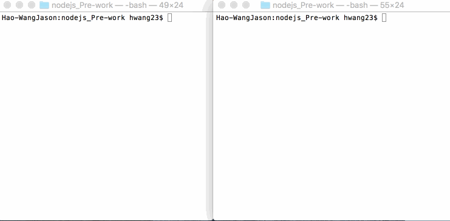

This is the Proxy Server for Node.js as a pre-work
# Proxy Server

This is a Proxy Server for Node.js submitted as the [pre-work](http://courses.codepath.com/snippets/intro_to_nodejs/prework) requirement for CodePath.

Time spent: 2 hours

Completed:

* [x] Required: Requests to port `8000` are echoed back with the same HTTP headers and body
* [x] Required: Requests/reponses are proxied to/from the destination server
* [x] Required: The destination server is configurable via the `--host`, `--port`  or `--url` arguments
* [x] Required: The destination server is configurable via the `x-destination-url` header
* [x] Required: Client requests and respones are printed to stdout
* [x] Required: The `--logfile` argument outputs all logs to the file specified instead of stdout
* [] Optional: The `--exec` argument proxies stdin/stdout to/from the destination program
* [] Optional: The `--loglevel` argument sets the logging chattiness
* [] Optional: Supports HTTPS
* [] Optional: `-h` argument prints CLI API

Walkthrough Gif:
[Add walkthrough.gif to the project root]



Note: to embed the gif file, just check your gif file into your repo and update the name of the file above.

## Starting the Server

```bash
npm start
```
nodemon --  index.js

## Features

### Echo Server:

```bash

curl http://127.0.0.1:8000/asdf -d 'hello world' -H 'foo: bar' -v
*   Trying 127.0.0.1...
* Connected to 127.0.0.1 (127.0.0.1) port 8000 (#0)
> POST /asdf HTTP/1.1
> Host: 127.0.0.1:8000
> User-Agent: curl/7.43.0
> Accept: */*
> foo: bar
> Content-Length: 11
> Content-Type: application/x-www-form-urlencoded
> 
* upload completely sent off: 11 out of 11 bytes
< HTTP/1.1 200 OK
< host: 127.0.0.1:8000
< user-agent: curl/7.43.0
< accept: */*
< foo: bar
< content-length: 11
< content-type: application/x-www-form-urlencoded
< Date: Sat, 17 Sep 2016 05:51:57 GMT
< Connection: keep-alive
< 
* Connection #0 to host 127.0.0.1 left intact
hello world
```

### Proxy Server:

Port 8001 will proxy to the echo server on port 8000.

```bash
curl http://127.0.0.1:8001/asdf -d 'hello world' -H 'foo: bar' -v
*   Trying 127.0.0.1...
* Connected to 127.0.0.1 (127.0.0.1) port 8001 (#0)
> POST /asdf HTTP/1.1
> Host: 127.0.0.1:8001
> User-Agent: curl/7.43.0
> Accept: */*
> foo: bar
> Content-Length: 11
> Content-Type: application/x-www-form-urlencoded
> 
* upload completely sent off: 11 out of 11 bytes
< HTTP/1.1 200 OK
< host: 127.0.0.1:8000
< user-agent: curl/7.43.0
< accept: */*
< foo: bar
< content-length: 11
< content-type: application/x-www-form-urlencoded
< connection: close
< date: Sat, 17 Sep 2016 05:53:53 GMT
< 
* Closing connection 0
hello world
```

### Configuration:

#### CLI Arguments:

The following CLI arguments are supported:

##### `--host`

The host of the destination server. Defaults to `127.0.0.1`.

nodemon index.js --host=google.com

curl http://127.0.0.1:8001 -H 'foo: bar' -v
* Rebuilt URL to: http://127.0.0.1:8001/
*   Trying 127.0.0.1...
* Connected to 127.0.0.1 (127.0.0.1) port 8001 (#0)
> GET / HTTP/1.1
> Host: 127.0.0.1:8001
> User-Agent: curl/7.43.0
> Accept: */*
> foo: bar
> 
< HTTP/1.1 200 OK
< date: Sat, 17 Sep 2016 05:57:19 GMT
< expires: -1
< cache-control: private, max-age=0
< content-type: text/html; charset=ISO-8859-1
< p3p: CP="This is not a P3P policy! See https://www.google.com/support/accounts/answer/151657?hl=en for more info."
< server: gws
< x-xss-protection: 1; mode=block
< x-frame-options: SAMEORIGIN
< set-cookie: NID=86=Hu30TTOWvDBcGr50dFLJVDVUWvrBNOPNm2PyLLQXc05lnxYS4FjmpFoqD-LPtOOn4HuqOnIK-W-w-p4OWxGfWZiMRHAUh_O53ac1NDSMqN9FoH-2yxOYezDJarfPtxcqGOSy_x8JdqRAx4w; expires=Sun, 19-Mar-2017 05:57:19 GMT; path=/; domain=.google.com; HttpOnly
< accept-ranges: none
< vary: Accept-Encoding
< connection: close
......


##### `--port`

The port of the destination server. Defaults to `80` or `8000` when a host is not specified.

nodemon index.js --port=8000

curl http://127.0.0.1:8000/asdf -d 'hello world' -H 'foo: bar' -v
*   Trying 127.0.0.1...
* Connected to 127.0.0.1 (127.0.0.1) port 8000 (#0)
> POST /asdf HTTP/1.1
> Host: 127.0.0.1:8000
> User-Agent: curl/7.43.0
> Accept: */*
> foo: bar
> Content-Length: 11
> Content-Type: application/x-www-form-urlencoded
> 
* upload completely sent off: 11 out of 11 bytes
< HTTP/1.1 200 OK
< host: 127.0.0.1:8000
< user-agent: curl/7.43.0
< accept: */*
< foo: bar
< content-length: 11
< content-type: application/x-www-form-urlencoded
< Date: Sat, 17 Sep 2016 05:59:52 GMT
< Connection: keep-alive
< 
* Connection #0 to host 127.0.0.1 left intact
hello world 


##### `--url`

A single url that overrides the above. E.g., `http://www.google.com`

##### `--logfile`

Specify a file path to redirect logging to.

nodemon index.js --host=google.com --logfile=log.txt

cat log.txt

echoServer listening @ 127.0.0.1:8000
proxyServer listening @ 127.0.0.1:8001
proxyServer
{"host":"127.0.0.1:8001","user-agent":"curl/7.43.0","accept":"*/*","foo":"bar","x-destination-url":"127.0.0.1:8000"}
echoServer
{"host":"127.0.0.1:8000","user-agent":"curl/7.43.0","accept":"*/*","foo":"bar","x-destination-url":"127.0.0.1:8000","connection":"close"}

#### Headers

The follow http header(s) are supported:

-H 'foo: bar' 
-H 'x-destination-url: 127.0.0.1:8000' 

##### `x-destination-url`

curl http://127.0.0.1:8001 -H 'foo: bar'  -H 'x-destination-url: 127.0.0.1:8000'   -v -d 'hello world' 
* Rebuilt URL to: http://127.0.0.1:8001/
*   Trying 127.0.0.1...
* Connected to 127.0.0.1 (127.0.0.1) port 8001 (#0)
> POST / HTTP/1.1
> Host: 127.0.0.1:8001
> User-Agent: curl/7.43.0
> Accept: */*
> foo: bar
> x-destination-url: 127.0.0.1:8000
> Content-Length: 11
> Content-Type: application/x-www-form-urlencoded
> 
* upload completely sent off: 11 out of 11 bytes
< HTTP/1.1 200 OK
< host: 127.0.0.1:8000
< user-agent: curl/7.43.0
< accept: */*
< foo: bar
< x-destination-url: 127.0.0.1:8000
< content-length: 11
< content-type: application/x-www-form-urlencoded
< connection: close
< date: Sat, 17 Sep 2016 06:03:49 GMT
< 
* Closing connection 0
hello world

Specify the destination url on a per request basis. Overrides and follows the same format as the `--url` argument.
